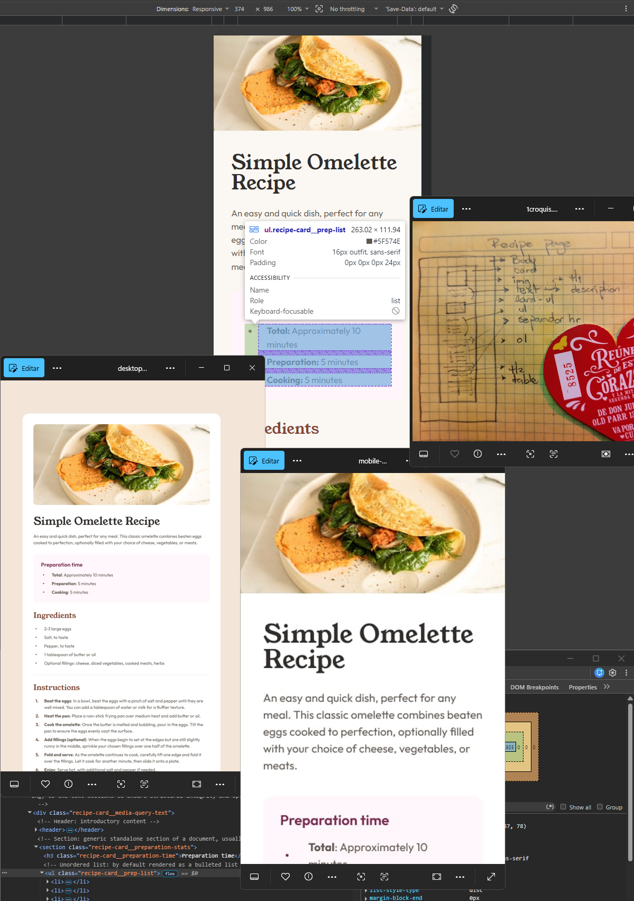
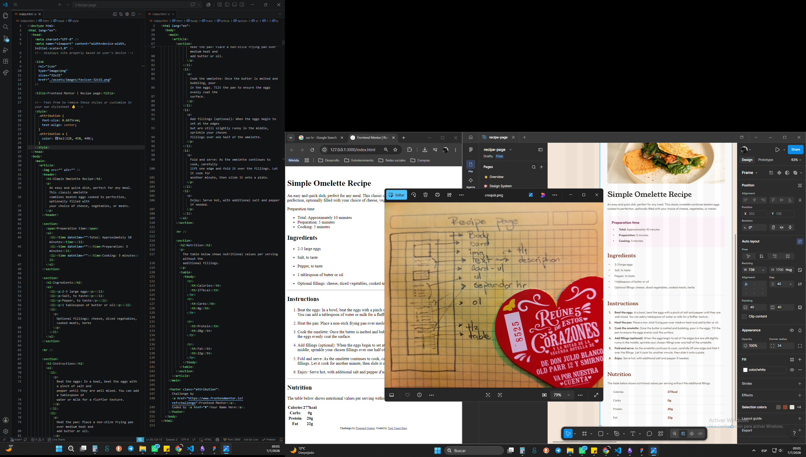

# Frontend Mentor - Recipe page solution

This is a solution to the [Recipe page challenge on Frontend Mentor](https://www.frontendmentor.io/challenges/recipe-page-KiTsR8QQKm). Frontend Mentor challenges help you improve your coding skills by building realistic projects.

## Table of contents

- [Overview](#overview)
  - [Links](#links)
- [My process](#my-process)
  - [Built with](#built-with)
  - [What I learned](#what-i-learned)
  - [Continued development](#continued-development)
  - [Useful resources](#useful-resources)
  - [AI Collaboration](#ai-collaboration)
- [Author](#author)
- [Acknowledgments](#acknowledgments)

## Overview



This is my take on the **Recipe Page challenge** from Frontend Mentor.

My goal for this project was to build a clean, responsive recipe page that matches the professional design perfectly. Instead of just guessing where to put things, I focused on building a real system. I used a **"Design Token Vault"** to keep my colors and spacing organized, and I used "swimming pool lanes" in my CSS to make sure the code is easy to follow.
I built this using a **Desktop-to-Mobile Iteration approach**. One of the coolest parts is the **"environmental sensor"** I created; it detects when you're on a phone (375px) and switches the layout so the image touches the edges of the screen (full-bleed), while keeping the text safe and easy to read in its own "inner room". I also made sure it’s accessible for everyone, even including special codes like **ISO 8601** for machines to understand the cooking times.

### Links

- Solution URL: [GitHub Repo](https://github.com/ezra1492/frontend-mentor-recipe-page)
- Live Site URL: [Recipe Page (gh-pages)](https://ezra1492.github.io/frontend-mentor-recipe-page/)

## My process

### Built with

- **Semantic HTML5 markup** - Used for the foundation, including special tags like `<time>` with **ISO 8601** so machines can understand cooking times.

  ```html
  <!-- Time: represents a specific period of time, translate dates into machine-readeble format -->
  <time datetime="PT10M"
    ><span class="recipe-card__time-head">Total: </span>
    Approximately 10 minutes
  </time>
  …
  ```

- **CSS custom properties** – This is my **"Design Token Vault"** where I stored all my colors and spacing to keep everything organized.
- **Flexbox** – My main tool for positioning elements, like the instructions list, to make sure the spacing is perfect.
- **Desktop-to-Mobile Iteration** – I chose to implement the full desktop version first (1440px) to establish a solid structural baseline. Once the desktop "Blueprint" was perfect, I used my **"Environmental Sensor"** (Media Query) to create a specific **"Mobile Protocol"**. This allowed me to deliberately deconstruct the desktop layout and adapt it into a **"Full-Bleed"** experience for small phone screens (375px).
- **BEM Methodology** – A naming system I used for my CSS classes to keep the structure clear and easy to read.

### What I learned

1. **The Blueprint (Planning Like an Architect)**

Before I touch a single line of code, I start by reviewing the project assets and making a physical sketch on paper. I draw out the design and use arrows to point out the different HTML layers and semantic tags I’ll need. This helps me visualize how to organize the document from the outside in and from the top down. By "building" the house on paper first, I can refine the structure and make sure the foundation is solid before I even start typing.



2. **The Design Token Vault (Staying Organized)**

To stop my CSS from turning into a mess, I got organized right away. I put all my "ingredients"—like colors and sizes from the Figma file—into a "Design Token Vault". To keep from getting lost in my work, I used big, clear labels I call **"Swimming Pool Lanes"** to separate each section of code so I can find things in a second.

```css
/* =================
DESIGN TOKEN VAULT ↓
==================== */
:root {
  /* ------
  SPACING ↓
  --------- */

  /* PRIMITIVE SPACING (The what, raw units) */
  --sp-1600: 8rem; /* 128px */
  --sp-600: 3rem; /* 48px */
  --sp-500: 2.5rem; /* 40px */
  --sp-450: 2.25rem; /* 36px */
  --sp-400: 2rem; /* 32px */
  --sp-350: 1.75rem; /* 28px */
  --sp-300: 1.5rem; /* 24px */
  --sp-250: 1.25rem; /* 20px */
  --sp-200: 1rem; /* 16px */
  --sp-150: 0.75rem; /* 12px */
  --sp-100: 0.5rem; /* 8px */

  /* ATTRIBUTION */
  --sp-fs-footer: 0.6875rem; /* 11px */
  --sp-br-footer: 0.25rem; /* 4px */

  /* VIEWPORT BOUNDARIES */
  --sp-wd-min: 23.4375rem; /* 375px Mobile, min-width */
  --sp-wd-max: 46rem; /* 736px Dessktop, max-width */
  …
}
```

3. **Solving Layout Puzzles (The Pro Tricks)**

Building the page piece by piece taught me some clever ways to fix common problems:

- **The List Alignment Trick (Keeping Everything Straight)**
  I learned that using `text-indent` on lists can be a bit of a trap. While it pushes the first line of text away from the bullet, any text after that jumps back to the left. This causes the second line to sit near the bullet point, which breaks the clean, professional look from the Figma design. To fix this and keep the entire block of text perfectly lined up, I used `padding-left` instead. This ensures that no matter how many lines of text there are, they all stay in their own "column", separate from the bullets.
  

- **Flexbox vs. Margins:** I stopped fighting with individual margins on every list item. Instead, I used Flexbox and **"gap"**, which lets the computer handle the spacing automatically.
  

  ```css
  /* ----------------------
    INSTRUCTIONS SECTION ↓
    ---------------------- */

  .recipe-card__instruction-list {
    display: flex;
    flex-direction: column;
    gap: var(
      --mrg-list-bottom
    ); /* Flexbox gap ensures total control over child spacing, eliminating redundant margins on the final list item */
    padding-left: var(--pd-instructions);
    line-height: var(--lh-150);
  }

  .recipe-card__instruction-list li::marker {
    font-weight: var(--fw-bold);
    color: var(--clr-subtitle);
  }

  .recipe-card__instruction-list li {
    padding-left: var(--pd-list);
  }

  .recipe-card__instruction-step {
    font-weight: var(--fw-bold);
  }

  /* ----------------------
    INSTRUCTIONS SECTION ↑
    ---------------------- */
  ```

  

- **The 50/50 Table Rule:** I found out that if you give each side of a table exactly 50% width, the middle line stays perfectly straight and professional.
  

4. **The Environmental Sensor (Smart Mobile Design)**
   My favorite discovery was thinking of Media Queries as an **"Environmental Sensor"**. My site actually "senses" when it’s being viewed on a small phone screen and switches to a "Mobile Protocol". It gets rid of extra space on the sides and lets the main image stretch all the way to the edges of the phone (Full-Bleed), so the recipe looks amazing on any device.
   

### Continued development

Even though I’m really happy with how this recipe page turned out, there are a few areas I want to keep practicing in my next projects:

- **Fluid Typography with `clamp()`:** Right now, I used `clamp()` to make the card width act like a "rubber band". In the future, I want to do the same for my text. Instead of the font size "jumping" between mobile and desktop, I want it to grow and shrink smoothly as you resize the window so it always looks perfect.

- **Deep-Dive into Accessibility:** I learned how to use the `datetime` attribute to help machines understand cooking times. Now, I want to learn even more tricks to make my sites easier for everyone to use, especially when it comes to making complex tables simple for screen readers.

- **Testing Every Screen Size:** The design guide mentioned testing everything from very small phones (320px) to huge monitors. I want to get better at making sure my layouts never have an "awkward phase" when the screen is somewhere in between the standard sizes.

- **Refining my Commit Strategy:** I’ve been practicing "Atomic Commits" by saving my HTML "blueprints" and my CSS "decorating" separately. I want to keep doing this so my project history is as organized as a well-written book.

### Useful resources

- [ISO 8601 Format Guide (Rank Math)](https://rankmath.com/kb/iso-8601-format/) – This was my "cheat sheet" for learning how to write time codes that computers can understand. It helped me correctly set the `datetime` attribute so search engines know exactly how long the recipe takes to prepare and cook.

- [HTML Tables Explained (Video)](https://www.youtube.com/watch?v=lXxEm9thbiQ) – This video was a lifesaver for the nutrition section! It clearly explained how to use `tr` for rows, `th` for headers, and `td` for the actual data bits.

- [g-akca's Recipe Page Solution](https://github.com/g-akca/recipe-page) – This helped me see a really smart way to handle tablet screens. Even though I stuck to the **375px mobile size** from the official style guide, I learned a lot from how they used a **560px breakpoint** to make the design work for small tablets.

### AI Collaboration

For this challenge, I used an AI to act as a **Senior Reviewer** to help me polish my work and think more like an architect.

- **What tools did you use?** I collaborated with **NotebookLM**, guided by a **"Master System Prompt"** that ensures it acts as a high-level mentor rather than just a code generator.

- **How did you use them?**
  - **Polishing Documentation:** The AI helped me refine my code comments, turning them into **"Swimming Pool Lanes"**. This makes my CSS much easier to read and maintain for future versions.

  - **Reviewing Patterns:** Even though I’ve used **ISO 8601** and **BEM** before, we used our sessions to double-check my implementation and ensure my "Mental Schema" for these tools is as sharp as possible.

  - **Analyzing Peer Solutions:** The AI helped me deconstruct solutions from other developers (like **g-akca**). We broke down their tablet logic so I could decide exactly how to apply those lessons to my own 375px mobile "sensor".

  - **Structural Refinement:** I used the AI to help me better document my own engineering ideas. I integrated the **"Gift-Box Framework"** (a concept from my personal Master Prompt), and together we brainstormed names like the **"Environmental Sensor"** to describe how my code reacts to different screen sizes.

- **What worked well? What didn't?**
  - **What worked:** The AI was excellent at helping me improve the clarity of my technical notes. It pushed me to explain why I chose specific fixes, like using `padding-left` instead of `text-indent` for list resilience.

  - **What didn't:** At times, the AI would try to jump to the next step or section too quickly. I had to remind it to stick to my **"Maestro" protocol** so we could finish deconstructing the current problem before moving on. This helped me maintain my iterative approach without missing any details.

## Author

- Frontend Mentor - [@ezra1492](https://github.com/ezra1492)
- X / Twitter - [@RayG1492](https://x.com/RayG1492)
- Discord - `rayg._86220`

## Acknowledgments

I want to give a big thank you to **g-akca**! I had already practiced using media queries in my [Scrimba Basketball Scoreboard project](https://github.com/ezra1492/scrimba-basketball-scoreboard/tree/main), but studying g-akca's work was a huge help. Their "tablet-friendly" approach was a great reminder of how to make designs even more flexible for different devices.
